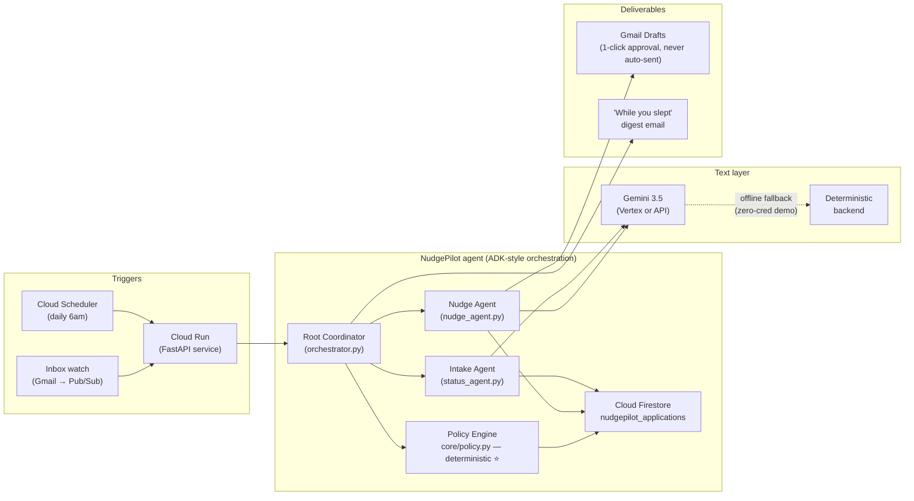

**Design note:** every *decision* (when to nudge / stop / ghost) lives in deterministic,
unit-tested `core/policy.py`. Gemini is confined to language: extraction, classification,
drafting. That split is the architectural-discipline story.